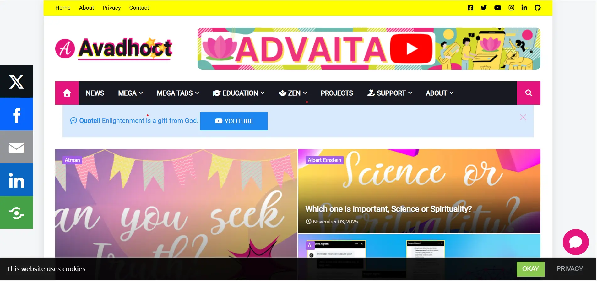

## Avadhoot.Me

This is my personal Blog and Vlog. I am using Blogger to share my thoughts and experiences. Blogger is the most popular, free, and simplest blogging framework maintained by Google.

## Blogger

## Gallery

## Follow on YouTube
